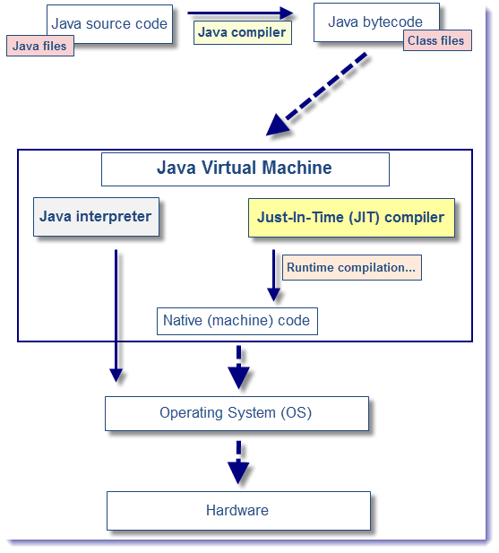
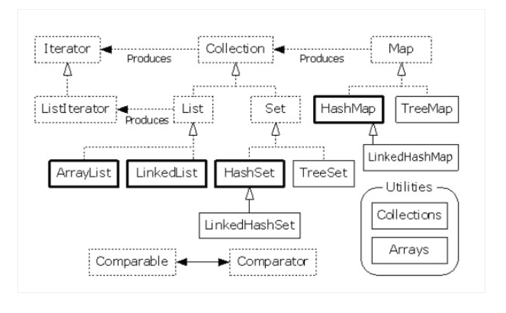
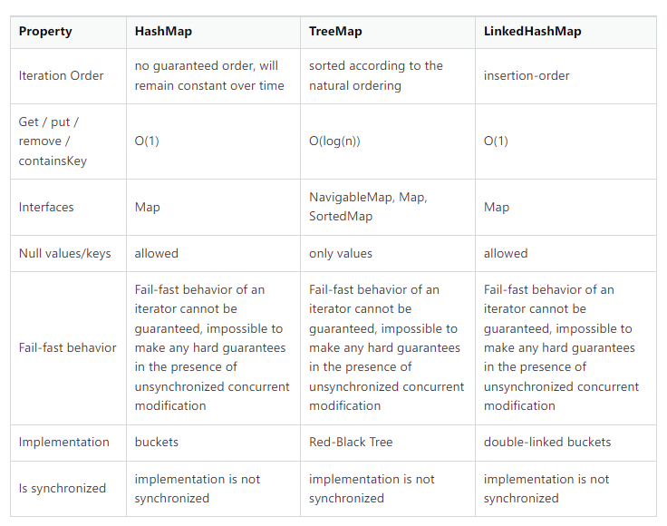
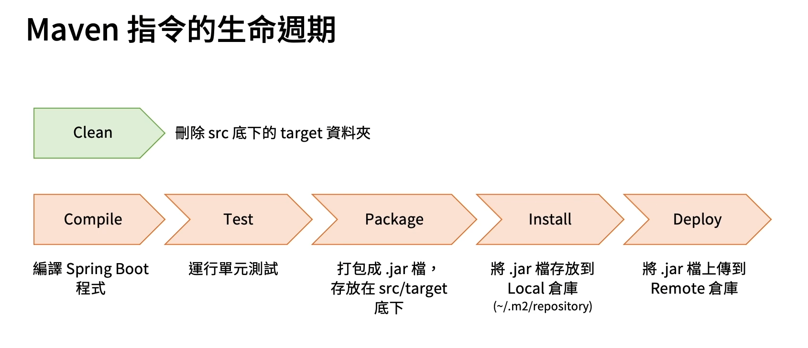
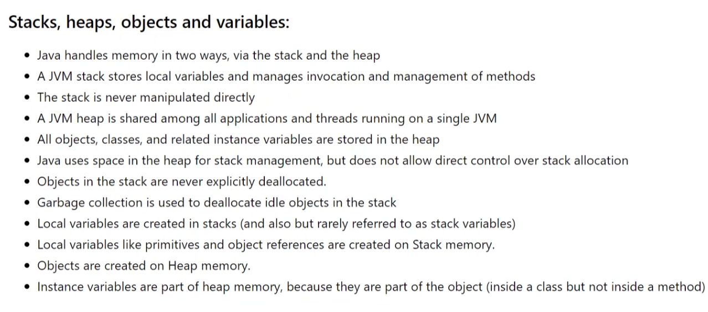

- ## 1. 以下對於Java Language的敘述，何者為非
  - 1.Java是一種向後兼容的語言
  - 2.Java是一種物件導向的語言
  - 3.Java是一種半開源的語言，另一半由Oracle掌握並管理
  - 4.Java是一種跨平台性的語言

Ans: 3


- ## 2. 下列何種順序是Java程式在Windows平台的執行流程

  - 1.撰寫 Java 程式 -> 利用Windows平台內建的 Javac 編譯器，編譯產生Windows的machine code -> 交由Windows執行
  - 2.撰寫 Java 程式 -> 利用JDK裡面的Javac編譯器，編譯產生 JVM 可執行的Java byte code ->利用 JVM 的 JIT / Java Interprter，編譯產生Windows可執行的machine code ->  交由Windows執行
  - 3.撰寫 Java 程式 -> 利用Windows平台內建的 Javac編譯器，編譯產生 JVM 可執行的Java byte code ->利用 JVM 的 JIT / Java Interprter，編譯產生Windows可執行的machine code ->  交由Windows執行
  - 4.撰寫 Java 程式 -> 利用JDK裡面的Javac編譯器，編譯產生 JVM 可執行的machine code ->利用 JVM 的 JIT / Java Interprter，編譯產生Windows可執行的Java byte code ->  交由Windows執行

Ans: 2 (引用自<http://www.tastones.com/zh-tw/stackoverflow/java-language/just-in-time-jit-compiler/overview/>)

- ## 3. 下列程式碼中，何者為錯
  - 1.char a = '中';
  - 2.char b = 'b';
  - 3.char c = '\t';
  - 4.char d = -98;

Ans: 4 char變量不能爲負值。字符數據類型的範圍爲0到65535

- ## 4. 下列程式碼中，何者正確
  - 1.Object $event = new Object();
  - 2.Object name = new Object();
  - 3.Object false = new Object();
  - 4.Object _name = new Object();
  
Ans: 2 Java命名方式不能以 底線,$,數字 開頭，且不能使用保留字

- ## 5.將一個int 變數 a = 5， 與另一個 short 變數 b = 120 相加，不能使用下列何種類型的變數儲存其值
  - 1.int
  - 2.short
  - 3.float
  - 4.Interger

Ans: 2 Java中數值類型的變數相加，會自動提升為容量大的變數類型，另外此容量並不是依據占用記憶體的空間去比較，而是用表示「數字」的範圍去比較
       例如:float占用4個位元組，而long占用8個位元組，但兩者相加如果使用long類型的變數儲存，會報錯

- ## 6. 下列何者關於 record 紀錄類別的敘述為非
  - 1.record class 會幫我們自動生成了 toString(), hashCode() 和equals()方法
  - 2.record class 會幫我們自動生成了 toString(), getter() 和 setter()方法
  - 3.record class 的狀態是 immutable 的，也不能在類別本體去定義非 static 的 fiel 並且不能被繼承等限制
  - 4.Java 16以後，紀錄類別才成為正式特性

Ans: 2, record class並不會生成 setter()方法，紀錄類別在語義上，就是作為不可變動的資料載體，在JEP 395一開頭的摘要，就明確地寫到「記錄類別就是不可變資料的透明載體（transparent carriers ）」，透明指的是，無論是在名稱、結構、狀態上，記錄類別都明確地曝露、表現出來，沒有任何隱藏。(<https://www.ithome.com.tw/voice/147531>)

- ## 7. 以下程式碼中，變數 a , b , sum 的結果分別為何? 
  ```Java
     public static void main(String[] args) {
        int a = 10;
        int b = 10;
        int sum = a++ + b;
        System.out.println("a:" + a);
        System.out.println("b:" + b);
        System.out.println("sum:" + sum);
    }
  ```
  - 1.a = 11, b = 10, sum = 20
  - 2.a = 11, b = 10, sum = 21
  - 3.a = 10, b = 10, sum = 20
  - 4.a = 10, b = 10, sum = 21

Ans: 1 , 此程式碼中，a 會先用後加，故結果為20 ，而 a 為 11


- ## 8. 以下程式碼中，會輸出何種結果

  ```Java 
  public static void main(String[] args) {
     int[] arr = new int[5];
        System.out.println(arr[5]);
    }
  ```
  - 1.零
  - 2.一
  - 3.五
  - 4.Index 5 out of bounds for length 5

Ans: 4 

- ## 9. 以下程式碼中，會輸出何種結果

  ```
  public static void main(String[] args) {
     int[] arr = new int[5];
        System.out.println(arr[0]);
    }
  ```

  - 1.零
  - 2.一
  - 3.五
  - 4.Index 5 out of bounds for length 5

Ans: 1 ， 若未初始化陣列元素，Java 會根據陣列型別給予預設值，而 int 型別的預設值為 0

- ## 10. 下列何者對List敘述為非
  - 1.`List <int> list = new ArrayList<>();`是一個存儲 int 類型的陣列清單
  - 2.繼承自 Collection 介面，並且被 ArrayList 及 LinkedList 兩個類別實作
  - 3.可以使用`forEach()`方法遍歷陣列清單中的各元素並執行特定操做
  - 4.可以利用`of()`方法直接初始化陣列清單
  
Ans: 1 ，ArrayList 儲存的元素為物件，故需要使用包裝類別 Interger 才是對的 (引用自<https://dotblogs.com.tw/kent2480/2014/01/16/140343>)


- ## 11. 以下程式碼中會輸出何種結果?
  ```Java
  Set set=new HashSet();
  String s1=new String("hello");
  String s2=s1;
  String s3=new String("world");

  set.add(s1);
  set.add(s2);
  set.add(s3);

  System.out.println(set.size());
  ```
  - 1. 0
  - 2. 1
  - 3. 2
  - 4. 3
Ans: 3 , HashSet 繼承自 Set 介面，所以同樣不允許重覆的物件存在，並且對於加入的元素也不保證排序

- ## 12. 下列何者敘述何者為非
  - 1.HashMap 就像 HashSet ，是用來存放不須強調先後次序的鍵值集集合
  
  - 2.如果在多線程時應使用 HashMap 保證線程安全
  
  - 3.若有排序需求的話，可以使用 LinkedHashMap 類別
  
  - 4.TreeMap 不允許 key 值存放 null，但 value 值可以存放null

Ans:2 , 多線程時應使用ConCurrentHashMap 類別以保證線程安全，關於HashMap/TreeMap/LinkedHashMap 特點如下  (引用自:<https://stackoverflow.com/questions/2889777/difference-between-hashmap-linkedhashmap-and-treemap>)


- ## 13. 以下程式碼中會輸出何種結果?
  ```Java
  public static void main(String[] args) {
       int x=0;

        int y=0;

        do{

            y++;

            ++x;

            }while(x <= 5);

        System.out.println("x = " + x + "," + "y = " + y);

    }
  ```
  - 1.x = 5,y = 5
  
  - 2.x = 5,y = 6
  
  - 3.x = 6,y = 5
  
  - 4.x = 6,y = 6

Ans: 4

- ## 14. 以下程式碼中，i 及 list 分別會輸出何種結果?
  ```Java
  public static void main(String[] args) {
        List<Integer> list = new ArrayList<>();
        list.add(1);
        list.add(2);
        list.add(3);
        for (Integer i :list
             ) {
            i += 1;
            System.out.println("i = " + i);
        }
        System.out.println("list = " + list);
    }
  ```

  - 1.i = 1, i = 2, i = 3, list = [1, 2, 3]
  
  - 2.i = 1, i = 2, i = 3, list = [2, 3, 4]
  
  - 3.i = 2, i = 3, i = 4, list = [1, 2, 3]
  
  - 4.i = 2, i = 3, i = 4, list = [2, 3, 4]

Ans: 3 ，foreach雖然能遍歷陣列或者集合，但是只能用來遍歷，無法在遍歷的過程中對陣列或者集合進行修改，而for迴圈可以在遍歷的過程中對源陣列或者集合進行修改。

- ## 15. 下列何者對於 Maven 的敘述何者為非
  - 1.在一個Spring Boot 專案中我們不只可以使用 Maven 作為管理專案的工具，也可以使用 Gradle ，不同的是 Maven 使用 XML 的配置進行設定，而 Gradle 則使用 Groovy的配置
  
  - 2.在運行 Maven 指令時，我們可以使用 `./mvnw` 代替 `mvn` 確保在一個開源的專案項目中，不會因 Maven 的版本不同導致專案無法正確 Build 起(必須在pom.xml中添加plugIn，因為Maven Wrapper是一個Maven的插件)
  
  - 3.Maven中有本地倉庫及遠端倉庫，用來儲存依賴的Library，並且本地倉庫預設位置在user目錄下的.m2/repository
  
  - 4.Maven提供了不同指令，並且這些指令分別是相互獨立的，以確保我們能夠分別完成我們的需求

Ans: 4 , Maven的指令執行是有生命周期的如下圖，橘色線中的指令執行時都會執行自己前面的指令 

- ## 16. 下列何者關於 Package 的敘述何者為非
  
  
  - 1.同一套件的類別必須存放在相同的資料夾並且給予一個有意義的名字
  - 2.要將類別包裝在套件中，必須在程式最開頭使用`package`敘述，標示出類別所屬的套件名稱，並且類別的存取修飾必須為Public
  - 3.我們可以將建立套件資料夾的工作交給 javac 編譯器處理，只需要在編譯時使用參數 `-d` 指定編譯結果的儲存路徑
  - 4.如果程式與程式內所使用的套件，位於同一路徑下時，只需要使用一般的編譯方式即可， JVM 會自動在程式的所屬資料夾下，尋找是否有套件名的子資料夾，且子資料夾下是否有所指定的類別檔案

Ans: 1 , 套件資料夾的名稱必須與程式內宣告的名稱相同，即使使用有意義的名稱當作資料夾名字，仍會編譯失敗

- ## 17. 以下敘述何者為非

  - 1.在 Java 中，我們使用 `getter` 和 `setter` 方法，來封裝類別的資訊，避免其他人直接修改到類別的成員變數
  - 2.在成員變數前加上 `static` 存取控制字符，表示所有屬於此類別的物件，都會共享這個成員
  - 3.使用 `final` 字符，可以限制成員變數在設定過初值後，就不允許修改
  - 4.在 Java 中，方法傳遞的參數是pass by reference

Ans: 4 , 在 Java 中是 always pass by value 的，簡單說，pass-by-value和pass-by-reference的差別在於傳遞的是「複製的參數」還是「原本的參數」，若傳遞的是複製的參數則為pass-by-value，若沒複製而是傳遞原來的參數則為pass-by-reference。

- ## 18. 以下敘述何者為非
  
  - 1.我們可以通過設定 JVM 的方式來操控 stack 與 heap
  - 2.在 Java 中，所有的物件、類別以及相關的變數都是儲存於 heap 當中
  - 3.Stack 和 Heap 是 JVM 記憶體儲存資料或指令的區域
  - 4.Java 與 C++ 一樣可以使用`delete`釋放記憶體資源，避免記憶體洩漏

Ans: 1 


- ## 19. 請問以下程式碼中的物件 c，其成員變數 y 的值為何?
  ```Java
  class Test{
    public int x;
    public static int y;
    
    public Test(int x, int y){
        this.x = x;
        this.y = y;
    }
  }

  public class Main {

      public static void main(String[] args) {
          Test a = new Test(100, 60);
          Test b = new Test(100, 70);
          Test c = new Test(100, 80);
      }
  }
  ```

  - 1.60
  - 2.70
  - 3.80
  - 4.null

Ans: 3

- ## 20. 承上題，物件 a 的成員變數 y 的值為何?

  - 1.60
  - 2.70
  - 3.80
  - 4.null

Ans: 3 